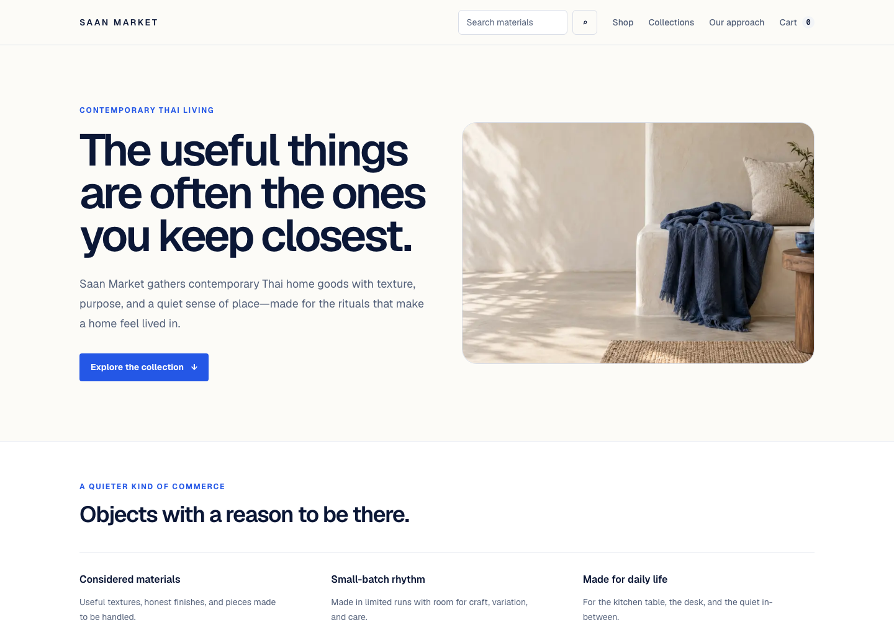
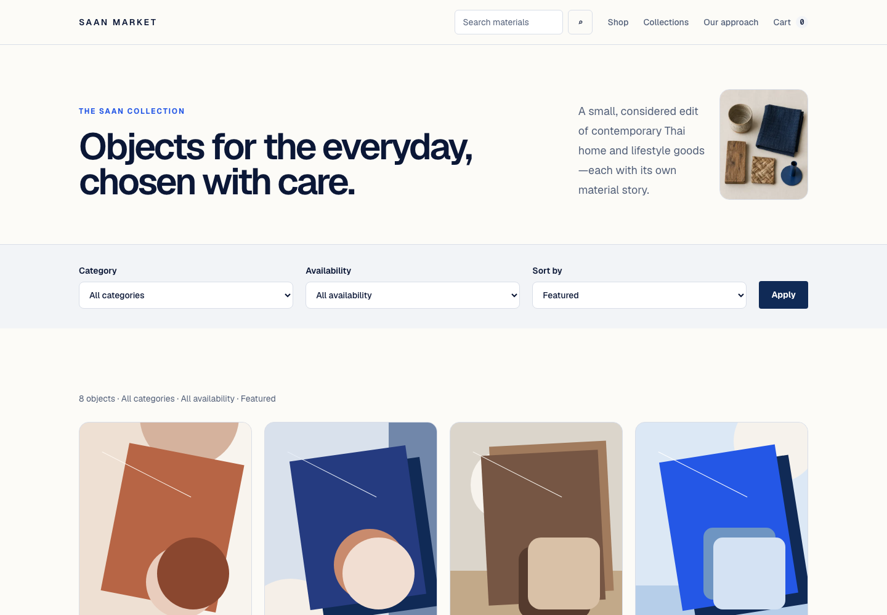
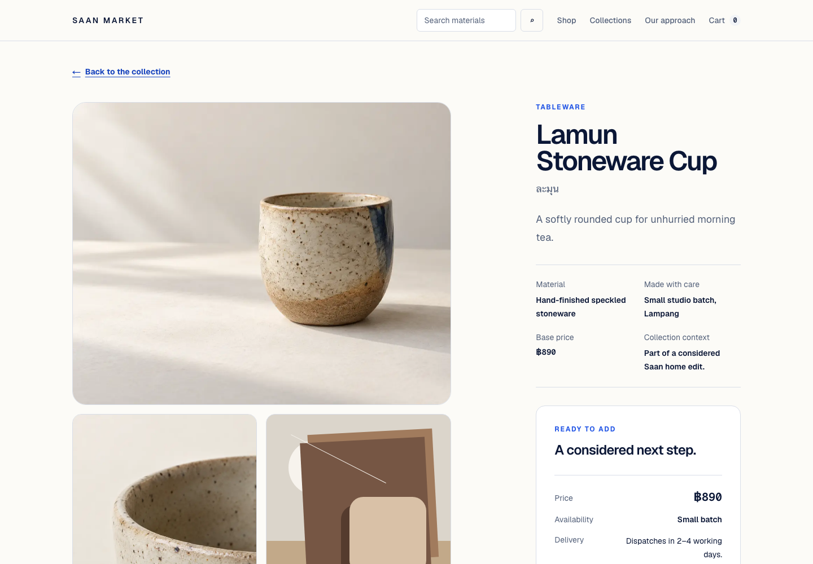

# Saan Market

Saan Market is a fictional, frontend-first storefront for contemporary Thai home and lifestyle goods. It is a portfolio project designed to show polished responsive UI, thoughtful commerce UX, accessibility, client-side state, testing, and credible full-stack fundamentals without pretending to be a production retailer.

The brand and products are original. Saan Market does not imitate or represent a real company.

## Live demo

[Open Saan Market on Vercel](https://saan-market.vercel.app). Checkout is intentionally simulated: no payment is processed and no customer data is stored.

## Product preview

<p align="center">
  
</p>

<p align="center">
  
  
</p>

Screenshots are captured from the public production demo.

## Project status

**Complete and publicly deployed.** Saan Market is a portfolio-ready, frontend-first commerce experience with product discovery, search, a persistent client-side cart, and a simulated checkout. It intentionally remains a fictional storefront rather than a production retail system.

## Product scope

The experience lets a shopper:

- Discover curated Thai-made home and lifestyle goods through editorial merchandising.
- Browse and filter a responsive product collection.
- Understand materials, craft, price, availability, and delivery details on a product page.
- Select product options and manage a persistent client-side cart.
- Complete a clearly labelled simulated checkout flow.
- Recover gracefully from empty, loading, error, and no-results states.

Representative fictional products will use Thai names with concise English descriptions and Thai baht prices, for example **Baan Rim Nam Linen Throw** and **Monsoon Indigo Table Runner**.

## Non-goals

- No real payments, orders, fulfilment, or inventory integration.
- No authentication, customer accounts, admin console, or marketplace sellers.
- No external commerce platform, CMS, or third-party product API in the initial build.
- No database until a milestone demonstrates a clear portfolio benefit.
- No microservices, event infrastructure, or enterprise abstractions.
- No imitation of an existing retailer or use of real customer data.

## Stack

| Area | Choice |
| --- | --- |
| Framework | Next.js 16 App Router and React 19 |
| Language | TypeScript with strict checking |
| Styling | Tailwind CSS 4 with CSS design tokens |
| Package manager | pnpm 12 |
| Runtime | Node.js 24+ (see `.nvmrc`) |
| State | Zustand for a small persistent cart store; display data and totals are derived from typed fixtures |
| Unit/component testing | Vitest and React Testing Library |
| Browser testing | Manual keyboard, responsive reflow, and production-route reviews at desktop, 375 px, and 320 px |

The architecture defaults to Server Components and adds Client Components only where interaction or browser state requires them. Product fixtures will be local, typed, and replaceable so the UI can later consume a route handler or data source without a rewrite.

## Implemented route map

| Route | Purpose |
| --- | --- |
| `/` | Editorial home, featured collection, and brand story |
| `/shop` | Product grid with category/availability filters, sorting, and result states |
| `/products/[slug]` | Product story, gallery, variants, availability, and add-to-cart controls |
| `/search` | Shareable, fixture-backed search with empty and no-results states |
| `/cart` | Editable, persistent client-side cart summary |
| `/checkout` | Clearly simulated checkout UX; no payment processing or customer-data persistence |
| `not-found` | Branded recovery path for unknown products |

Collection curation is expressed through the editorial home and shop views; a dedicated collection landing route is intentionally outside the current portfolio scope.

## Data model outline

- **Product:** `id`, `slug`, English display name, optional Thai name, description, price in satang, category, materials, provenance, images, badges, availability, and variant IDs.
- **ProductVariant:** `id`, product ID, option values, SKU, price override, and stock status.
- **Collection:** `id`, `slug`, title, summary, hero image, and ordered product IDs.
- **CartLine:** variant ID and quantity only; product presentation data is derived from the fixtures at render time.
- **Cart:** versioned persisted lines plus derived item count and subtotal.

Money remains integer satang in data and is formatted to Thai baht at the presentation boundary. Product and collection fixtures will be validated at startup or test time. Derived totals are calculated rather than stored independently.

## Accessibility commitments

The target is WCAG 2.2 AA for the portfolio experience:

- Semantic landmarks, logical headings, descriptive page titles, and a skip link.
- Complete keyboard operation with visible focus indicators and no keyboard traps.
- Minimum 44 × 44 px touch targets for primary controls.
- Text and interactive-state contrast checked against AA thresholds.
- Useful image alternatives; decorative imagery receives empty alternative text.
- Form labels, inline errors, status announcements, and error summaries that do not rely on color alone.
- Motion kept restrained and disabled or reduced through `prefers-reduced-motion`.
- Cart changes announced without unexpectedly moving focus.
- Responsive zoom, reflow, and 320 px viewport support.

## Testing strategy

- **Static gates:** Vitest, ESLint, TypeScript strict mode, and production builds in local validation and GitHub Actions.
- **Unit tests:** money formatting, filtering, sorting, cart reducers/selectors, and fixture validation.
- **Component tests:** product cards, option selection, quantity controls, error states, and keyboard behavior.
- **Browser review:** browse → product → cart → simulated checkout at desktop, 375 px, and 320 px viewports.
- **Accessibility:** semantic landmarks, labels, live regions, keyboard, focus, and reflow checks on the core routes.
- **Visual quality:** production screenshots for the homepage, shop, and product detail routes; image crops and responsive layout are manually reviewed.

## Portfolio case study

### Product problem

Saan Market gives a junior frontend portfolio a complete commerce journey without misrepresenting prototype work as a real retail system. The fictional store makes the important interaction states—discovery, product options, a persistent cart, validation, and confirmation—visible to a recruiter in one calm, editorial experience.

### Key frontend decisions

- Next.js App Router keeps route metadata and fixture-driven discovery on the server by default, while small Client Components own only interactive work such as cart, options, and checkout validation.
- Typed local fixtures keep product, variant, price, availability, and collection relationships explicit and easy to exchange for a future API.
- URL parameters drive catalog filters and search so a discovery state can be refreshed and shared.
- `next/image` uses intrinsic dimensions and responsive `sizes`; the homepage hero alone has priority. Original assets remain PNGs because no verified writable WebP encoder exists locally, avoiding a conversion dependency until it is justified.

### Accessibility and client state

The storefront uses landmarks, skip links, visible focus, responsive reflow, labelled controls, polite cart/confirmation feedback, and inline checkout errors linked to their fields. Zustand persists only cart variant IDs and quantities; display data and totals are derived safely from fixtures, protecting the UI from stale storage.

### Prototype boundaries

Checkout is deliberately simulated. It is fixture-backed, never processes a payment, and never sends, logs, persists, or URL-encodes customer data. The production hostname now powers the sitemap, canonical metadata, and `robots.ts` sitemap reference.

## Milestones

0. **Foundation:** product brief, design direction, Next.js/Tailwind setup, quality scripts, and clean local history.
1. **Editorial storefront:** responsive shell, home page, typed fixture data, product-card foundation, and baseline tests.
2. **Catalog discovery:** shop, product detail, filters/sort, responsive imagery, and URL-driven state.
3. **Cart and search:** persistent cart, search, empty/error states, and focused interaction tests.
4. **Simulated checkout:** accessible form flow, validation, order summary, and end-to-end happy/error paths.
5. **Portfolio hardening:** performance and accessibility audit, metadata/social assets, CI, deployment configuration, and project case study.

Each milestone should be reviewable, pass the quality gates, and avoid pulling future work forward without a demonstrated need.

## Getting started

```bash
nvm use
corepack enable
pnpm install
pnpm dev
```

Open `http://localhost:3000`.

## Quality commands

```bash
pnpm lint
pnpm typecheck
pnpm test
pnpm build
```

## Design documentation

See [`docs/design-direction.md`](docs/design-direction.md) for the visual system, responsive rules, component direction, image guidance, and accessibility notes.
